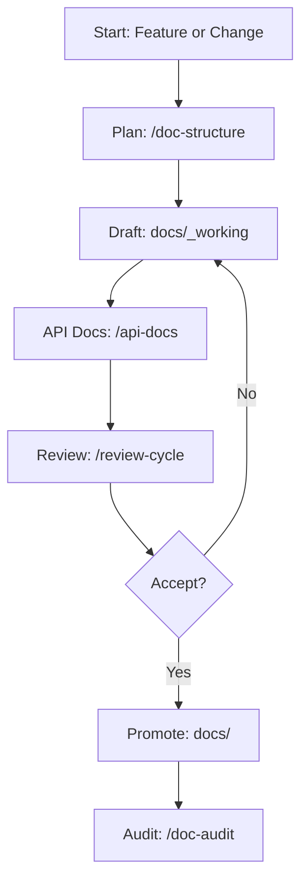

# Documentation Workflow Diagram Template

Use this Mermaid template to visualize your documentation process.

Guidance:

- Modify nodes to reflect your project's specifics.
- Link each node to the corresponding doc or command.
